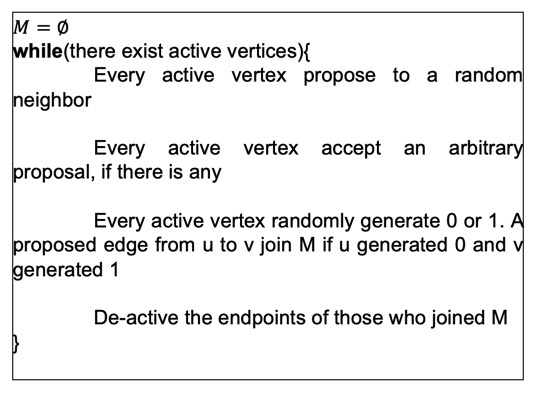

# Large Scale Data Processing: Final Project
## Aidan Shea


### Results
|           File name           |        Number of edges       | Matching Size | Computation and Run-Time in GCP |
| ------------------------------| ---------------------------- | ------------- | ------------------------------- |
| com-orkut.ungraph.csv         | 117185083                    | ------------- | ------------------------------- |
| twitter_original_edges.csv    | 63555749                     | ------------- |  ------------------------------ |
| soc-LiveJournal1.csv          | 42851237                     |  1048576      | 4 nodes x 5 cores, 2213s        |
| soc-pokec-relationships.csv   | 22301964                     |  598357       | 4 nodes x 5 cores,, 2452s       |
| musae_ENGB_edges.csv          | 35324                        |  2296         | 4 nodes x 4 cores,, 10s         |
| log_normal_100.csv            | 2671                         |  49           | 4 nodes x 4 cores,, 5s          |
#### All of the above reported matchings have been verified using the provided verifier.scala file and can be located in the matchings.zip file.
#### I was unable to output matchings for com_orkut.ungraph.csv and twitter_original_edges.csv due to memory constraints in GCP. I attempted to fix this by allowing for more memory caching within my program and attempting to allocate more memory for the worker nodes in the GCP but I was unable to allocate enough memory in order for the program to run to completion.

### Approach
##### I had originally planned on implementing the Israeli-Itai algorithm, of which the psuedo code is shown below, because it outputs a maximal matching and is guaranteed to be complete in O(logn) rounds.



##### I had some difficulty implemetning this function, so I graviateted towards Luby's algorithm which we had implemented for the previous project. Luby's algorithm oututs a maximal independent set of vertices, but rather than try to somehow transform this MIS into a maximal matching I decided to implement a modified version of the Luby's bidding variant algorithm for which the pseudocode is shown below.

```
maximal_matching = ∅
while (there exists active edges):
   each edge generates a number between 0 and 1
   vertices accept the highest edge value of which they are connected
   if (two neighborhing vertices share the same edge value):
      add that edge to maximal_matching
   deactivate any edges that were added to maximal_matching
```

##### Rather than having each vertex generate a random number between 0 and 1, this modified version has each edge generate a number between 0 and 1. These edge values are sent to its vertices, and each vertex accepts the highest edge value among the edges of which it is connected. If two neighboring vertices share the same edge value, then the edge that connects them is added to the maximal matching and the two vertices are deactivated. This process continues until there are no longer any edges in the graph which results in a maximal matching. Both this algoritm and the Israeli-Itai algorithm only provide a 1/2 approximation for the maximum matching, so the matching produced from this algorithm is very likely to contain less edges than the optimal maxium matching. If I were to receive a new test case, I would still beconfident in the algorthm in outputting a maximal matching with a 1/2 approximation, but I would be weary of memory usage depending on the size of the new test case.

### Algorithm Advantages
##### The bidding variant of Luby's Algorithm is guaranteed to be completed within O(logn) rounds, which helps with runtime which is a concern when using large datasets. 
##### The bidding variant of Luby's Algortithm has a 1/2 approximation because a constant fraction of vertices (along with their joining edges) become deactiavated with each round of the algorithm. Each edge gets preemptively removed at most twice, meaning the approximation provided by the algorithm is at worst 1/2 of the maximum matching.

### Difficulties
##### When running this algorithm on GCP, my program ran into some memory issues. This occured near the end of the program when running it on the some of the larger data sets. To fix this, I experimented with different combinations of cores for the master and worker nodes, along with different amounts of worker nodes in order to maximize the memory allocated to the program. I also edited my main method to incorporate more lines where the program could cache certain values, such as before and after creating the dataframe that would lead into the output file. If I had more time I would have implemented some sort of function to detect augmented paths in the maximal matching and then augment these paths in order to increase the matching which would have improved the matching beyond the 1/2 approxiamtion of the Luby's algorithm. I also would consider using the color coding algorhtm to transform the original graph into a bipartite graph, which might facilitate the finding and agumenting of augmented paths in the general graph. After ysing a color codin algorithm, I would then use another bidding variant of Luby's algorithm to find these agumented paths and augment them and therefore improve the matching result. 
